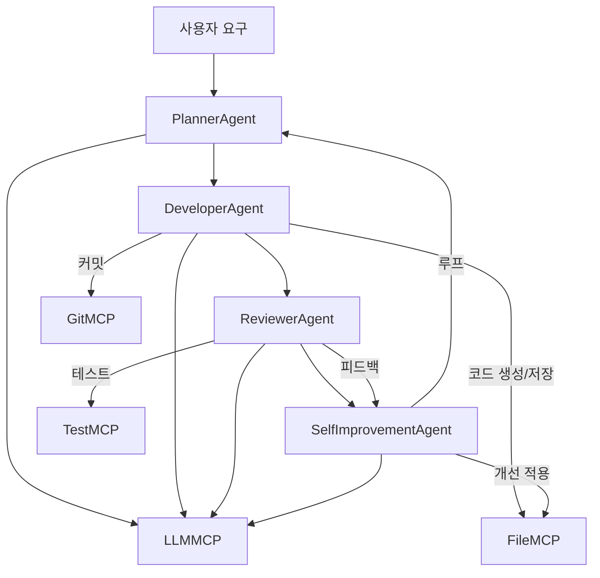

# Palantir AIP - 멀티에이전트/자가개선 오케스트레이션 설계 가이드

## 1. 전체 구조 개요
- **오케스트레이터**: Planner → Developer → Reviewer → SelfImprovementAgent 순으로 자동화 루프 실행
- **MCP 계층**: LLM, 파일, Git, 테스트, 웹검색 등 도구를 안전하게 추상화
- **자가개선 루프**: 코드 분석→개선안 생성→적용→테스트→롤백/이력관리까지 반복

## 2. Mermaid 아키텍처 다이어그램


## 3. 각 에이전트/컴포넌트 역할
- **PlannerAgent**: 사용자 요구를 태스크 리스트로 분해 (LLM MCP 활용)
- **DeveloperAgent**: 태스크별 코드/작업 생성, 파일 저장, Git 커밋 (LLM/파일/Git MCP 활용)
- **ReviewerAgent**: 테스트 실행, 코드 리뷰/피드백 (Test/LLM MCP 활용)
- **SelfImprovementAgent**: 코드/운영/지식 자가개선 루프(분석→개선안→적용→테스트→이력)
- **MCP 계층**: LLM, 파일, Git, 테스트, 웹 MCP 등 도구 추상화/보안/로깅/예외처리 담당

## 4. 오케스트레이터 예시 코드
```python
from palantir.core.orchestrator import Orchestrator
orch = Orchestrator()
result = orch.run("간단한 파이썬 프로그램 작성")
print(result)
```

## 5. 확장/운영 가이드
- **에이전트 확장**: 각 역할별 프롬프트/로직/워크플로우 자유롭게 커스터마이즈
- **MCP 확장**: services/mcp/에 새로운 도구/외부 API 연동 가능
- **오케스트레이션 고도화**: Orchestrator에서 그래프형 분기/병렬/에러복구/서브그래프 등 확장 가능
- **테스트/운영 자동화**: pytest 기반 단위 테스트, 예외/로깅/보안 강화, Mermaid 등 구조 시각화

## 6. 참고/문서
- 설계/로드맵/지침: project.md, ai_agent_self_improvement.md, ai_agent.md 등 참고
- 실제 코드/테스트: core/agents.py, core/orchestrator.py, services/mcp/, tests/test_agents.py 등 