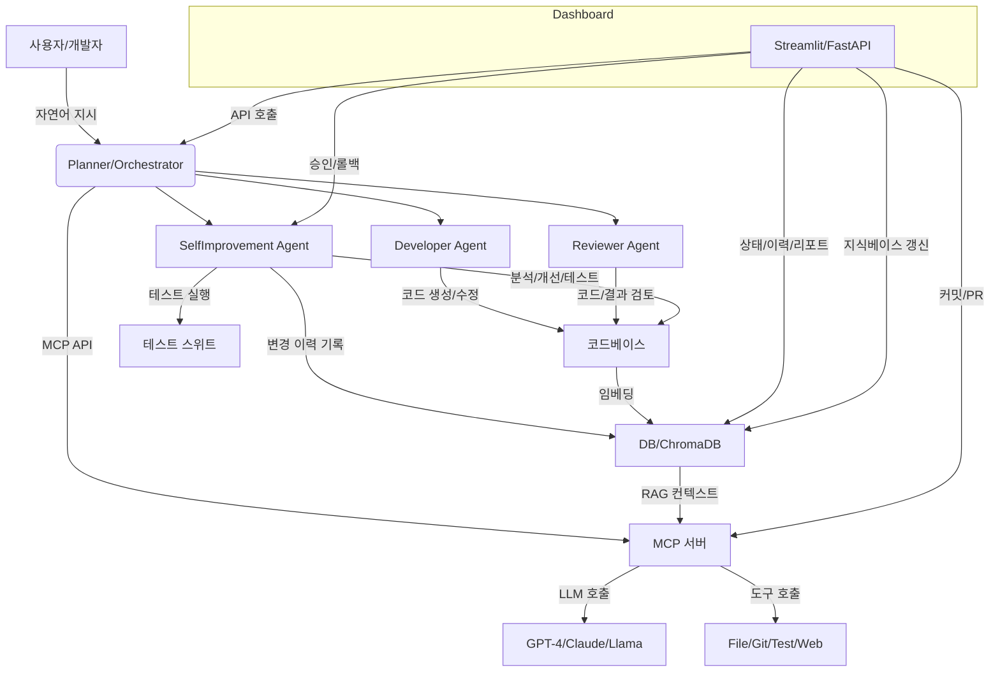

# Palantir AIP - 자가개선형 멀티에이전트 오케스트레이션 플랫폼

이 프로젝트는 WSL Ubuntu 환경에서 실행되는 자가-개선 AI 에이전트 시스템입니다.

## 개요
- **멀티에이전트 오케스트레이션**: Planner/Developer/Reviewer/SelfImprover 등 역할별 에이전트가 자동 협업하며, Reviewer→SelfImprover→Reviewer 루프, 3회 실패 시 Planner 재계획, 상태 기반 분기/이력/알림/정책/Slack 연동까지 지원
- **MCP 계층**: LLM, 파일, Git, 테스트, 웹 등 도구를 안전하게 추상화하며, 테스트 자동화(테스트+린트+정적분석+보안+복잡도+뮤테이션 등)와 정책/가드레일/알림(위험 명령/반복 실패/정책 위반 시 Slack 등 알림) 내장
- **자가개선 루프**: 코드 분석→개선안→적용→테스트→롤백/이력관리까지 자동화, 상태/이력/반복/알림/정책/Slack 연동
- **온톨로지/ETL/ML/임베딩/DB/대시보드/API/문서화**: 실전 데이터/AI/운영/시각화/문서화까지 통합, 온톨로지 객체/관계/유효성/추천/분석/이벤트/상태/실시간 연동 지원
- **테스트/운영/보안/CI/CD**: pytest, pre-commit, GitHub Actions, docker-compose, Prometheus/Grafana, JWT 등 실전 인프라 적용, .cursorrules 정책/가드레일/알림 내장

## 시스템 요구사항
- Windows 11 22H2 + WSL 2 (Ubuntu 22.04 LTS)
- Docker Desktop 4.29+ (WSL 2 backend)
- Python 3.12
- GPU 사용 시: NVIDIA CUDA 12 WSL driver

## 정책/환경
- **반드시 WSL Ubuntu 환경에서 실행** (PowerShell 금지)
- **위험 명령 차단/정책/가드레일/알림**: .cursorrules 정책 적용, 반복 실패/정책 위반/위험 명령 시 자동 중단 및 Slack 등 알림

## 주요 폴더 구조
```
palantir/
  core/           # 에이전트, 오케스트레이터, 공통 추상화
  services/mcp/   # LLM, 파일, Git, 테스트, 웹 MCP 계층
  api/            # FastAPI 엔드포인트 (추천/분석/이벤트/상태 등 실전 API)
  models/         # LLM/임베딩/AI 계층
  ontology/       # 온톨로지/지식그래프 (객체/관계/유효성/추천/분석/이벤트)
  process/        # 워크플로우/ETL/ML/임베딩 (실전 파이프라인)
  ui/             # Streamlit 대시보드 (실시간 상태/추천/분석/이벤트/알림)
  tests/          # 단위/통합/보안/성능/자동화 테스트
```

## 설치 및 실행 방법

1. WSL Ubuntu 설치:
```bash
wsl --install
wsl --update
wsl --set-default-version 2
```
2. Docker Desktop 설치 및 WSL 통합 설정
3. 프로젝트 설정:
```bash
git clone [repository-url]
cd [project-directory]
pip install -r requirements.txt
```
4. FastAPI 서버 실행:
```bash
uvicorn palantir.api.main:app --reload --host 0.0.0.0 --port 8000
```
5. Streamlit 대시보드 실행:
```bash
streamlit run palantir/ui/app.py
```
6. Prefect ETL/ML 파이프라인 실행:
```bash
python -m palantir.process.flows
```

## 환경 변수 설정
프로젝트 루트 디렉토리에 `.env` 파일을 생성하고 다음 변수들을 설정하세요:
```bash
# API 설정
API_KEY=your-secret-api-key
API_BASE_URL=http://localhost:8000
# 데이터베이스 설정
DB_PATH=./data/agent.db
# 로깅 설정
LOG_LEVEL=INFO
LOG_FILE=./logs/app.log
# 모니터링 설정
ENABLE_METRICS=true
METRICS_PORT=9090
# 보안 설정
ALLOWED_ORIGINS=["http://localhost:8501"]
CORS_ENABLED=true
# 리소스 제한
MAX_WORKERS=4
MAX_REQUESTS=1000
TIMEOUT=30
```

## 주요 실전 API/엔드포인트 예시
- `/ontology/recommend_products/{customer_id}`: 고객별 추천 상품
- `/ontology/order_timeline/{order_id}`: 주문별 이벤트 타임라인
- `/ontology/similar_products/{product_id}`: 유사 상품 추천
- `/ontology/alerts`: 실시간 알림/상태
- `/ontology/graph`: 온톨로지 네트워크/관계 그래프

## 대시보드/자동화 루프/실시간 연동
- Streamlit 대시보드: 에이전트 상태, 테스트 결과, 온톨로지 객체/관계/추천/분석/이벤트/실시간 알림 등 시각화
- 자가개선 루프: 코드 분석→개선안→적용→테스트→롤백/이력관리, 반복 실패/정책 위반/위험 명령 시 자동 중단 및 Slack 등 알림
- ETL/ML/임베딩 파이프라인: 데이터 적재→임베딩 생성→ChromaDB 적재→ML 실험→온톨로지/이벤트 기록, 실시간 객체/관계/임베딩 자동 갱신

## 테스트/운영 자동화
```bash
pytest -v
```
- tests/test_agents.py: 에이전트/오케스트레이터 단위 테스트(LLM 모킹)
- Prefect Flow, API, 대시보드, ETL/ML, 관계/이벤트 생성 등 통합 테스트
- MCP/테스트 자동화(테스트+린트+정적분석+보안+복잡도+뮤테이션 등)

## 모니터링/운영 자동화
- Prometheus, Grafana, docker-compose, 로그/이벤트/상태 모니터링 등 운영 자동화
- 운영 정책, .cursorrules, JWT 인증/권한, 보안/정책/FAQ 등 참고
- Slack 등 실시간 알림 연동

## 개발 로드맵
### Q1 (환경 & MCP 핵심)
- Builder-MCP API 구현
- GitHub Actions CI 설정
- 기본 워크플로우 구현
### Q2 (데이터 파이프라인 & 온톨로지)
- 데이터 수집 및 처리 파이프라인
- 온톨로지 V1 구현
- GitHub API 연동
### Q3 (ML 엔진·RAG·대시보드)
- MLflow 통합
- RAG 시스템 구현
- Streamlit 대시보드
### Q4 (액션·자동화·자가 개선)
- 자동화 워크플로우
- 자가-개선 루프
- UI 구현

## 시스템 아키텍처 (2025)


## 주요 구조 및 자동화 루프 요약
- 중앙 오케스트레이터(Planner)가 사용자 지시를 Task로 분해, 각 전문 에이전트에게 분배
- Developer/Reviewer/SelfImprovement Agent가 코드 생성/검토/자가 개선 루프 수행
- MCP 서버를 통해 다양한 LLM(모델 agnostic) 및 도구(File, Git, Test, Web) 호출
- 코드/문서 임베딩 → ChromaDB 저장 → RAG 컨텍스트로 LLM 프롬프트에 자동 주입
- 모든 변경 이력은 DB+Git으로 추적, 승인/롤백/커밋/PR 자동화
- Streamlit 대시보드에서 상태/이력/리포트/지식베이스 갱신/승인/롤백 등 운영 가능

## 운영 방법(요약)
1. WSL/Ubuntu 환경에서 Docker Compose로 전체 서비스 실행
2. 대시보드에서 자가 개선 프리뷰/적용/롤백, 지식베이스 갱신, 운영 모니터링 가능
3. 모든 변경은 자동 백업+DB+Git 이력 관리, 필요시 롤백/PR/CI 연동

## 확장/커스터마이징/문서
- MCP/온톨로지/에이전트/오케스트레이터/대시보드/정책 등 자유롭게 확장
- 주요 문서: AGENTS.md, ai_agent_self_improvement.md, ai_aigent_orchestration.md, 개발상황.md 등 참고
- 기여 가이드: CONTRIBUTING.md, .github/ 폴더 참고

## FAQ/참고
- 실전 활용/운영/확장/테스트/보안/정책 등 FAQ 및 주요 가이드 docs/ 폴더 참고
- 자세한 설계/로드맵/지침은 AGENTS.md, ai_agent_self_improvement.md 등 문서 참고

## 라이선스
MIT License
