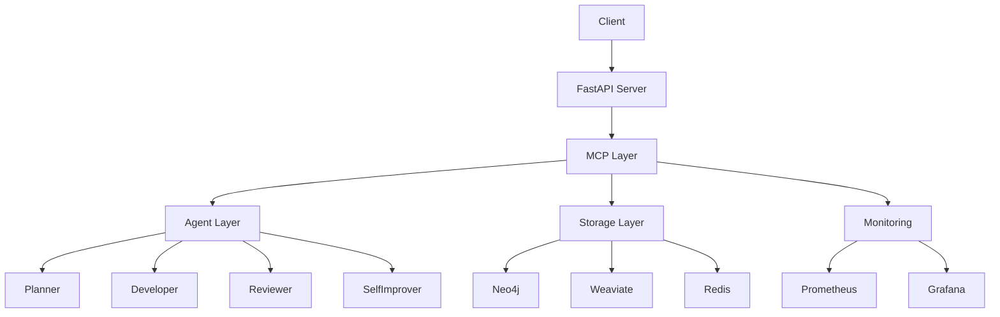

# Palantir

자가개선형 멀티에이전트 오케스트레이션 플랫폼

## 개요

Palantir는 다음과 같은 주요 기능을 제공하는 AI 기반 오케스트레이션 플랫폼입니다:

- 멀티에이전트 시스템: Planner, Developer, Reviewer, SelfImprover 에이전트의 협업
- 온톨로지 기반 지식 관리: Neo4j와 Weaviate를 활용한 지식 그래프 및 벡터 검색
- 자가 개선: 성능 모니터링 및 자동 최적화
- MCP(Model Context Protocol): 다양한 LLM과 도구의 통합 인터페이스

## 시스템 아키텍처



## 설치 및 실행

### 요구사항

- Python 3.12+
- Poetry

### 설치

1. 저장소 클론:
```bash
git clone https://github.com/yourusername/palantir.git
cd palantir
```

2. 가상환경 생성 및 의존성 설치:
```bash
python -m venv .venv
source .venv/bin/activate  # Windows: .venv\Scripts\activate
pip install poetry
poetry install
```

3. 서비스 실행:
```bash
poetry run python main.py
```

### 환경 변수 설정

`.env` 파일을 생성하고 다음 변수들을 설정하세요:

```env
NEO4J_URL=bolt://localhost:7687
NEO4J_USER=neo4j
NEO4J_PASSWORD=test

WEAVIATE_URL=http://localhost:8080

REDIS_URL=redis://localhost:6379

OPENAI_API_KEY=your_api_key
```

## API 엔드포인트

### 기본 엔드포인트

- `GET /status`: 시스템 상태 확인
- `GET /metrics`: Prometheus 메트릭

### 에이전트 API

- `POST /agents/plan`: 태스크 계획 수립
- `POST /agents/develop`: 코드 개발
- `POST /agents/review`: 코드 리뷰
- `POST /agents/improve`: 성능 개선

### 온톨로지 API

- `POST /ontology/query`: 온톨로지 쿼리
- `POST /ontology/events`: 이벤트 생성

## 모니터링

- Prometheus: http://localhost:9090
- Grafana: http://localhost:3000 (admin/admin)

## 개발 가이드

### 코드 스타일

- Black: 코드 포맷팅
- isort: 임포트 정렬
- Flake8: 린팅
- mypy: 타입 체크

### 테스트

```bash
poetry run pytest
```

### 문서화

```bash
poetry run sphinx-build -b html docs/source docs/build
```

## 라이선스

MIT License

## 기여

1. Fork the repository
2. Create your feature branch
3. Commit your changes
4. Push to the branch
5. Create a Pull Request
