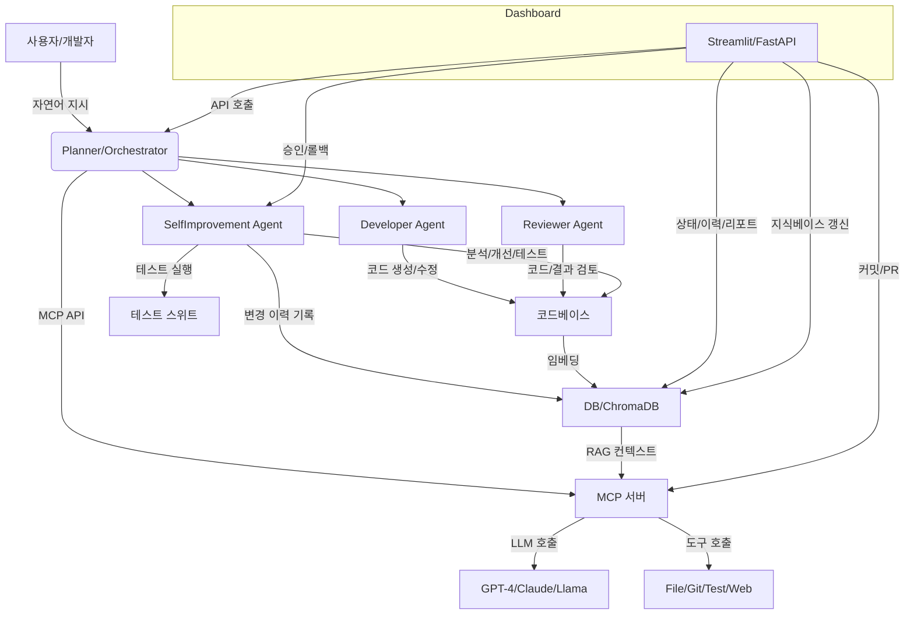

# AI 에이전트 개발 프로젝트

이 프로젝트는 WSL Ubuntu 환경에서 실행되는 자가-개선 AI 에이전트 시스템입니다.

## 시스템 요구사항

- Windows 11 22H2 + WSL 2 (Ubuntu 22.04 LTS)
- Docker Desktop 4.29+ (WSL 2 backend)
- Python 3.12
- GPU 사용 시: NVIDIA CUDA 12 WSL driver

## 설치 방법

1. WSL Ubuntu 설치:
```bash
wsl --install
wsl --update
wsl --set-default-version 2
```

2. Docker Desktop 설치 및 WSL 통합 설정

3. 프로젝트 설정:
```bash
git clone [repository-url]
cd [project-directory]
./scripts/setup.sh
```

## 환경 변수 설정

프로젝트 루트 디렉토리에 `.env` 파일을 생성하고 다음 변수들을 설정하세요:

```bash
# API 설정
API_KEY=your-secret-api-key
API_BASE_URL=http://localhost:8000

# 데이터베이스 설정
DB_PATH=./data/agent.db

# 로깅 설정
LOG_LEVEL=INFO
LOG_FILE=./logs/app.log

# 모니터링 설정
ENABLE_METRICS=true
METRICS_PORT=9090

# 보안 설정
ALLOWED_ORIGINS=["http://localhost:8501"]
CORS_ENABLED=true

# 리소스 제한
MAX_WORKERS=4
MAX_REQUESTS=1000
TIMEOUT=30
```

## 프로젝트 구조

- `src/`: 소스 코드
  - `agents/`: AI 에이전트 구현
  - `core/`: 핵심 기능
  - `utils/`: 유틸리티 함수
- `tests/`: 테스트 코드
- `scripts/`: 설정 및 유틸리티 스크립트

## 개발 로드맵

### Q1 (환경 & MCP 핵심)
- Builder-MCP API 구현
- GitHub Actions CI 설정
- 기본 워크플로우 구현

### Q2 (데이터 파이프라인 & 온톨로지)
- 데이터 수집 및 처리 파이프라인
- 온톨로지 V1 구현
- GitHub API 연동

### Q3 (ML 엔진·RAG·대시보드)
- MLflow 통합
- RAG 시스템 구현
- Streamlit 대시보드

### Q4 (액션·자동화·자가 개선)
- 자동화 워크플로우
- 자가-개선 루프
- UI 구현

## Docker 실행 방법

1. 환경 변수 설정:
```bash
cp .env.example .env
# .env 파일을 편집하여 필요한 값 설정
```

2. Docker 컨테이너 실행:
```bash
docker-compose up -d
```

3. 서비스 접속:
- API: http://localhost:8000
- 대시보드: http://localhost:8501

## 라이선스

MIT License 

## 시스템 아키텍처 (2025)



## 주요 구조 및 자동화 루프 요약
- 중앙 오케스트레이터(Planner)가 사용자 지시를 Task로 분해, 각 전문 에이전트에게 분배
- Developer/Reviewer/SelfImprovement Agent가 코드 생성/검토/자가 개선 루프 수행
- MCP 서버를 통해 다양한 LLM(모델 agnostic) 및 도구(File, Git, Test, Web) 호출
- 코드/문서 임베딩 → ChromaDB 저장 → RAG 컨텍스트로 LLM 프롬프트에 자동 주입
- 모든 변경 이력은 DB+Git으로 추적, 승인/롤백/커밋/PR 자동화
- Streamlit 대시보드에서 상태/이력/리포트/지식베이스 갱신/승인/롤백 등 운영 가능

## 운영 방법(요약)
1. WSL/Ubuntu 환경에서 Docker Compose로 전체 서비스 실행
2. 대시보드에서 자가 개선 프리뷰/적용/롤백, 지식베이스 갱신, 운영 모니터링 가능
3. 모든 변경은 자동 백업+DB+Git 이력 관리, 필요시 롤백/PR/CI 연동 